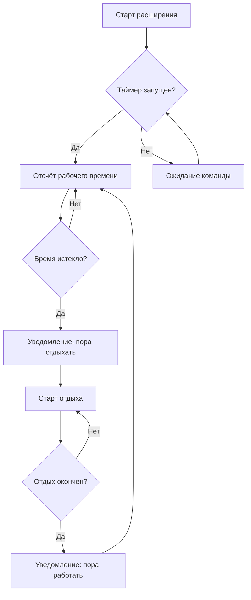

# Tomodoro Timer VS Code Extension

## Описание

Это расширение добавляет помодоро-таймер прямо в редактор Visual Studio Code. Вы сможете настраивать рабочие и паузные интервалы, видеть текущий статус прямо в строке состояния, получать уведомления о завершении этапов, а также удобно управлять таймером с помощью команд.

---

## Основные файлы

- **extension.ts** — основной точкой входа расширения. Регистрирует команды, связывает их с методами таймера.
- **timer.ts** — класс TomodoroTimer, реализующий логику таймера по принципу помодоро: чередование рабочих и паузных сессий, уведомления, интеграция с UI VS Code.

---

## Как работает расширение

### 1. Инициализация

- Расширение активируется при запуске или при обращении к зарегистрированным командам ('tomodoro.start', 'tomodoro.pause', 'tomodoro.reset', 'tomodoro.skip').
- Создаётся экземпляр класса TomodoroTimer.

### 2. TomodoroTimer (timer.ts)

**Основная логика:**
1. **Параметры таймера:**  
   - Время работы: 50 минут  
   - Время отдыха: 10 минут

2. **Методы:**
    - `start()` — запускает таймер. Обновляет строку состояния, начинает отсчёт рабочего интервала.
    - `pause()` — приостанавливает таймер, сохраняет прогресс.
    - `reset()` — сбрасывает текущее состояние, обновляет строку состояния.
    - `skip()` — принудительно завершает текущую фазу (работа/отдых), переключается на следующую.

3. **Переход фаз:**
    - После окончания 50 минут работы начинается 10-минутная пауза и наоборот.
    - В обоих случаях отображаются уведомления, появляется предложение начать следующий этап.

4. **UI интеграция:**
    - Статус/время всегда показывается в строке состояния VS Code.
    - Используются уведомления VSCode для общения с пользователем (например, "Рабочий этап завершён!").

### 3. Связь extension.ts ↔ timer.ts

- В extension.ts на каждую команду Quick Access (`tomodoro.start`, `tomodoro.pause` и др.) вешается вызов соответствующего метода экземпляра TomodoroTimer.  
- Все изменение статуса/взаимодействие с пользователем происходит через методы timer.ts.

---

## Управление

- `Tomodoro: Start` — запуск таймера.
- `Tomodoro: Pause` — пауза.
- `Tomodoro: Reset` — сброс таймера.
- `Tomodoro: Skip` — переход к следующей фазе (работа/отдых).

---

## Этапы работы таймера (Flowchart)

---

## Установка

1. Склонируйте репозиторий/расширение.
2. Откройте VS Code в директории проекта.
3. Нажмите F5 для запуска расширения в режиме разработчика.
4. Для публикации следуйте инструкциям в [vsc-extension-quickstart.md](vsc-extension-quickstart.md).

---

## Особенности

- Эффективная организация труда по методу помодоро.
- Яркие уведомления и визуализация текущего статуса.
- Простая интеграция, отсутствие лишних действий.

---

> Если нужна поддержка настраиваемых интервалов — смотрите настройки расширения (package.json).

---
